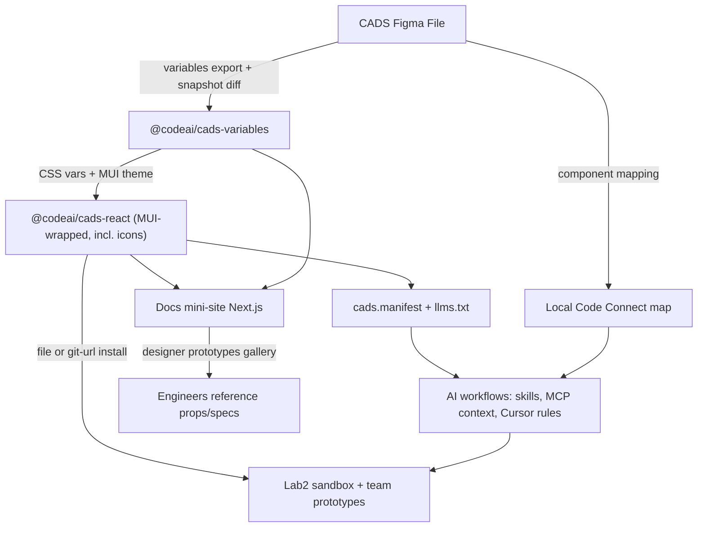

# Standalone CADS Platform — Plan (in-repo)

Canonical copy of the platform plan for agents working in this repo. Status of execution: see [`STATUS.md`](STATUS.md). Agent entrypoint: [`../AGENTS.md`](../AGENTS.md).

---

## Confirmed decisions

- **New standalone repo** (`cads`), consumed as packages; not in `code-dot-org`, not anchored to Lab2 `App*` components.
- **MUI under the hood, CADS API on top**: consumers import from `@codeai/cads-react`; MUI is an implementation detail that prod’s eventual MUI refactor can converge on.
- **Figma CADS file is the design source of truth** (`DGekOeToRVifvFAhfqpeC1`); code artifacts are generated/synced from it, never hand-forked.
- **Custom Next.js docs mini-site** (MUI/Spectrum-style), not Storybook.
- **Sequencing:** foundation first, docs second, AI workflows third — but AI-facing artifacts (manifest, Code Connect substitutes) are designed in from day one.

## Target architecture

## Phase 0 — Repo scaffold

- `packages/variables` → `@codeai/cads-variables`
- `packages/react` → `@codeai/cads-react` (components **and** icons under `/icons`)
- `apps/docs` → docs mini-site
- `tooling/figma-sync` → sync scripts + committed Figma snapshots
- Distribution: Git-URL / `file:` with committed `dist/`; GitHub Packages later under whatever GitHub org owns the repo
- FA Pro fonts: licensed, internal-only — ship in `@codeai/cads-react`

## Phase 1 — Variables package

- ColorSystem JSON + generators + Figma snapshot live under `packages/variables`
- `tooling/figma-sync`: four drift classes (values, mappings, naming, structure) + ID-matched renames
- Non-color: typography, spacing/shape, radii, elevation (eventually live-synced from Figma; initially ported)
- Outputs: `variables.css` (`--ds-*`, `:root` / `.dark`), typed TS object, generated MUI theme

## Phase 2 — Component package pilot

- Wrap MUI behind CADS-named exports; style with `--ds-*`; no hardcoded hex
- Pilot: Button, TextField, Checkbox, Radio, Tag, Tooltip
- Spec from Figma component sets; Lab2 `App*` is behavioral reference only
- Definition of done: variant/state parity with Figma, light + dark, a11y, TSDoc, manifest entry

## Phase 3 — Docs mini-site

- Next.js App Router; live playgrounds; props tables; variables pages; Figma deep links
- Designer prototype gallery for inspectable prototypes
- Long-term: props auto-gen from TS types (avoid hand-drift)

## Phase 4 — AI / Figma-parity layer

- `cadsManifest` in `@codeai/cads-react`
- Docs `/llms.txt`
- Local Code Connect map (`figma.code-connect.json` + MCP session maps) — no Enterprise publish
- Distributable Cursor skill: `.cursor/skills/cads-prototyping`
- End-to-end designer → agent → consumer prototype loop (still to run for real)

## Phase 5 — Lab2 consumption bridge

- Sibling `web-lab-prototype` installs via `file:`
- Route `/design-system/cads` for parity
- Do **not** big-bang replace `App*`
- Color sandbox stays exploratory in Lab2; export target for platform SoT is this repo’s variables document

## Resolved decisions (2026-07-16)

- FA Pro fonts: ship privately in `@codeai/cads-react`
- Naming: “variables” package; icons not a separate package
- npm: Git-URL / `file:` first; no official npm org required
- Code Connect: manifest + local map (no Enterprise)
- MUI: latest stable major, caret range, **regular dependency** of `@codeai/cads-react`
- Distribution: committed build outputs for Git-URL installs

## Open items

- Which GitHub org hosts the remote (affects eventual Packages scope only)
- Docs props generation from TS (honesty / anti-drift)
- Real Figma node IDs on every manifest entry
- Pixel parity verification of the pilot set against Figma
